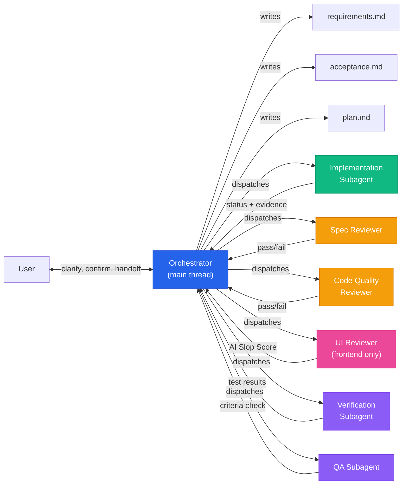
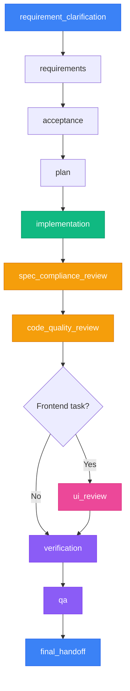
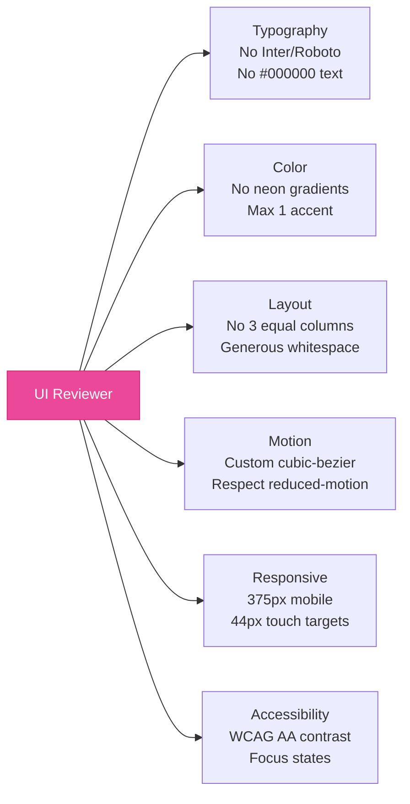

<p align="center">
    <a href="https://github.com/xzh20121116/agent-workflow/stargazers" alt="Stars">
        </a>
    <a href="https://github.com/xzh20121116/agent-workflow/blob/master/LICENSE" alt="License">
        </a>
    <a href="https://github.com/xzh20121116/agent-workflow/issues" alt="Issues">
        </a>
    <a href="https://github.com/xzh20121116/agent-workflow/releases/latest" alt="Latest Release">
        </a>
</p>

<h1 align="center">Agent Workflow</h1>

<p align="center"><strong>Stop letting your AI coding agent freestyle your codebase.</strong></p>

<p align="center">
    Lightweight workflow skills for Claude Code, Codex, and other AI coding agents.<br/>
    Turns a "vibe coder" into a disciplined project manager that clarifies requirements,<br/>
    delegates to subagents, runs reviews, and delivers evidence — before claiming it's done.
</p>

<p align="center">
    <a href="README.md"><strong>English</strong></a>
    ·
    <a href="README_zh-CN.md"><strong>中文</strong></a>
</p>

---

## Why This Exists

AI coding agents are powerful. But give them a complex task and watch what happens:

- They start coding before understanding the requirement
- The main thread does everything — chatting, coding, testing, reviewing — all in one bloated context
- Context gets compressed, goals get lost, behavior drifts
- They say "done" without running a single test
- The frontend looks like every other AI-generated page: Inter font, purple gradient, 3 equal columns
- You ask "did you test the error case?" and they start over from scratch

**Agent Workflow fixes this** by adding one constraint: **the main thread never touches code.**

It becomes an Orchestrator — a project manager that talks to you, clarifies requirements, delegates to specialized subagents, and delivers results with evidence. Every coding, testing, and review task goes to an independent subagent with a self-contained context packet. No conversation history leaking. No context bloat. No drift.

## Before / After

### Without Agent Workflow

```
User:  给个人中心加手机号修改功能
AI:    好的，我来改几个文件
AI:    [修改了 6 个文件]
AI:    已完成
User:  测了吗？
AI:    理论上应该可以
User:  旧手机号要验证吗？
AI:    好的，我加上
AI:    [又改了 4 个文件]
AI:    已完成
User:  UI 怎么还是三等分布局...
AI:    我来重新设计
AI:    [上下文已压缩，忘记了之前的讨论]
```

### With Agent Workflow

```
User:  用重任务流程处理：个人中心增加修改手机号功能

Orchestrator:
  1. "需要哪些验证方式？" → 短信验证码
  2. "旧手机号需要验证吗？" → 需要
  3. 写 requirements.md → 用户确认
  4. 写 acceptance.md → 用户确认
  5. 写 plan.md

  ── 派发 Implementation Subagent ──
     返回: DONE (4 files, tests passing)

  ── 派发 Spec Compliance Reviewer ──
     结果: PASS — all requirements covered

  ── 派发 Code Quality Reviewer ──
     结果: PASS

  ── 派发 Verification Subagent ──
     结果: PASS — 12 tests, 0 failures

  ── 派发 QA Subagent ──
     结果: PASS — 8/8 acceptance criteria

  → 交付：功能完成，附带测试证据
```

The user answered 3 questions. The Orchestrator managed the rest. Every step has evidence.

## How It Works



**The Orchestrator never edits code directly.** It only:

1. **Talks to the user** — requirement clarification, confirmations, final handoff
2. **Manages state** — reads/writes state.json, requirements, acceptance, plan
3. **Dispatches subagents** — builds self-contained context packets, delegates via Agent tool
4. **Synthesizes results** — handles subagent status, decides next action

## Why Subagents?

This isn't just architectural aesthetics. It solves real problems:

| Problem | How subagents fix it |
|---------|---------------------|
| **Context bloat** | Each subagent gets only what it needs — a focused context packet, not the entire conversation |
| **Goal drift** | Subagents have explicit stop conditions; they don't wander |
| **"Done" without evidence** | Verification and QA are separate subagents that run real tests, not vibes |
| **Reviewer bias** | The reviewer is a different subagent than the implementer — it reads the actual code, not the report |
| **Main thread overload** | The Orchestrator stays lightweight; code, tests, and reviews happen in parallel isolation |

## Workflow Stages



| Stage | Who runs | What happens |
|-------|----------|-------------|
| `requirement_clarification` | Orchestrator | Talks to user, clarifies ambiguities |
| `requirements` | Orchestrator | Writes requirements.md, user confirms |
| `acceptance` | Orchestrator | Writes acceptance.md with testable criteria, user confirms |
| `plan` | Orchestrator | Writes plan.md with executable task breakdown |
| `implementation` | Subagent | Implements code (worktree isolation for high-risk) |
| `spec_compliance_review` | Subagent | Reads actual code, compares to requirements line by line |
| `code_quality_review` | Subagent | Checks structure, correctness, maintainability |
| `ui_review` | Subagent | Catches AI slop — fonts, gradients, layout, responsiveness |
| `verification` | Subagent | Runs tests, lint, build |
| `qa` | Subagent | Verifies every acceptance criterion against code |
| `final_handoff` | Orchestrator | Reports results with evidence bundle |

## The UI Reviewer: Killing AI Slop

AI-generated frontends have a distinctive look: Inter font everywhere, purple-blue gradients, 3 equal columns, heavy shadows, placeholder content. We call this **AI slop**.

The UI Reviewer is a dedicated subagent that catches what code review misses:



It outputs an **AI Slop Score (0-10)**: 0 = looks handcrafted, 10 = maximum AI slop.

The frontend implementer also gets **design constraints injected into its prompt**: typography rules, color palette limits, layout patterns, motion guidelines, icon choices, and content rules (no placeholder names, no em-dashes, real copy only).

## Key Features

| Feature | What it does |
|---------|-------------|
| **Orchestrator-subagent separation** | Main thread coordinates, subagents execute. The Orchestrator never writes code. |
| **SubagentContextPacket** | Self-contained prompts with task, goal, files, non-goals, verification. No conversation history leaking. |
| **Two-stage review** | Spec compliance (did you build the right thing?) + code quality (did you build it well?) |
| **UI review** | AI Slop Score (0-10), responsive check, accessibility audit, design constraint enforcement |
| **Frontend design constraints** | Typography, color, layout, motion rules injected into implementation prompts |
| **Implementer 4-status return** | `DONE` / `DONE_WITH_CONCERNS` / `NEEDS_CONTEXT` / `BLOCKED` — Orchestrator handles each |
| **Checkpoint & resume** | Survives context resets via handoff.md. Never resumes from memory alone. |
| **Drift detection** | After each stage, verifies work still serves original intent |
| **Risk-based isolation** | High-risk tasks use git worktree isolation; medium-risk shares working directory |

## Quick Start

### AI-Assisted Install (Recommended)

Paste this to your AI coding agent:

```text
请阅读 https://github.com/xzh20121116/agent-workflow，帮我全局安装 agent-workflow 技能。
```

The agent will detect your host (Claude Code, Codex, etc.), clone the repo, set up the correct skill paths, and verify the installation.

### Manual Install

```bash
# Clone to a central location
git clone https://github.com/xzh20121116/agent-workflow.git ~/.agent-workflow

# Symlink to your host's skill directory
# Claude Code:
ln -s ~/.agent-workflow/skills/agent-workflow-init ~/.claude/skills/agent-workflow-init
ln -s ~/.agent-workflow/skills/agent-workflow-start ~/.claude/skills/agent-workflow-start

# Codex App:
ln -s ~/.agent-workflow/skills/agent-workflow-init ~/.codex/skills/agent-workflow-init
ln -s ~/.agent-workflow/skills/agent-workflow-start ~/.codex/skills/agent-workflow-start
```

## Usage

### Initialize a project

```text
帮我用 agent-workflow 初始化当前项目
```

This sets up `docs/agent/` with project config, request templates, and AGENTS.md.

### Start a feature (heavy workflow)

```text
用重任务流程处理：用户个人中心增加修改手机号功能
```

The Orchestrator will clarify requirements, write acceptance criteria, get your confirmation, then automatically delegate through the full stage flow.

### Fix a bug

```text
用重任务流程处理：支付回调偶发失败，大概一天出现几次
```

The Orchestrator investigates with you first, then delegates root cause analysis and fix to the implementation subagent.

### Beautify a frontend page

```text
用重任务流程美化 src/pages/landing/index.tsx 页面
```

Automatically uses the frontend implementer with design constraints, and adds a UI review stage.

### Run spec compliance review only

```text
帮我审查 src/services/auth.service.ts 是否符合 docs/requirements.md 中的需求
```

### Run code quality review only

```text
帮我做代码质量审查：src/services/order.service.ts
```

## Included Skills

Two skills, zero config:

| Skill | Purpose |
|-------|---------|
| `agent-workflow-init` | Project-level bootstrapper. Creates `docs/agent/` structure, AGENTS.md, project config. |
| `agent-workflow-start` | Request-level entry point. Creates request workspace, drives the full workflow from clarification to delivery. |

### Subagent Prompt Templates

Each role has a dedicated prompt template in `skills/agent-workflow-start/references/`:

| Template | Role | Key Feature |
|----------|------|-------------|
| `implementer-prompt.md` | Backend implementation | SubagentContextPacket, 4-status return |
| `frontend-implementer-prompt.md` | Frontend implementation | Design constraints (typography, color, layout, motion) |
| `spec-reviewer-prompt.md` | Spec compliance review | "Do Not Trust the Report" — reads actual code |
| `code-quality-reviewer-prompt.md` | Code quality review | Structure, correctness, maintainability |
| `ui-reviewer-prompt.md` | UI/visual review | AI Slop Score, responsive check, accessibility |
| `verification-prompt.md` | Test/lint/build | Runs project test suite |
| `qa-prompt.md` | Acceptance criteria | Verifies every criterion against code |

## Example Output

After a successful workflow run, you get:

```
docs/agent/requests/REQ-20260609-001/
├── requirements.md          # What we're building
├── acceptance.md            # How we verify it
├── plan.md                  # Task breakdown
├── state.json               # Machine-readable state
├── handoff.md               # Checkpoint for resume
├── implementation.md        # What was built, files changed
├── review.md                # Spec + code quality findings
├── verification.md          # Test results, lint output
└── qa.md                    # Acceptance criteria check
```

Every claim is backed by evidence. No "theoretically it should work."

## Origin Story

Agent Workflow came from **real daily usage** — hitting the same pain points over and over: AI agents freestyle-coding without understanding requirements, main threads bloating with code + tests + reviews all mixed together, context compression causing goal drift, and frontends that screamed "AI made this."

After building the initial version, the author found [Aegis](https://github.com/GanyuanRan/Aegis) and [Superpowers](https://github.com/obra/superpowers). Both had valuable ideas. Agent Workflow **absorbed the best of both** and added what was still missing.

## What Agent Workflow Does That Others Don't

| | Agent Workflow | Aegis | Superpowers |
|---|---|---|---|
| **Main thread** | **Never touches code** | Coordinator + baseline | Auto-trigger |
| **UI/Frontend** | **Design constraints + UI reviewer + AI Slop Score** | -- | -- |
| **Review** | **3-stage** (spec + quality + UI) | 2-stage | 2-stage |
| **Implementer** | **4-status return** | Subagent-driven | Plan-driven |
| **Context** | **SubagentContextPacket** (isolated) | Baseline context | Plan-as-junior |
| **Setup** | **Zero config** | Doctor script | Per-host plugin |
| **Best for** | **Frontend + discipline + simplicity** | Enterprise baseline | TDD teams |

### Why Agent Workflow wins on frontend projects

AI-generated frontends have a distinctive "plastic look" — Inter font, purple gradients, 3 equal columns, heavy shadows. **No other tool addresses this.**

Agent Workflow fights it on two fronts:

1. **Prevention** — The frontend implementer's prompt is injected with design constraints: typography rules, color palette limits, layout patterns, motion guidelines, icon choices, content rules
2. **Detection** — A dedicated UI Reviewer checks typography, color, layout, motion, responsiveness, and accessibility, then scores it with an **AI Slop Score (0-10)**

### Why Agent Workflow wins on context management

The #1 failure mode of AI coding agents on complex tasks: **context bloat → goal drift → amnesia**.

Agent Workflow solves this with strict Orchestrator separation + SubagentContextPacket:

- The Orchestrator never reads code, never writes code, never runs tests — its context stays clean
- Each subagent gets a self-contained packet (task, goal, files, non-goals, verification) — no conversation history leaking in
- After each stage, a checkpoint is written to `handoff.md` — context resets don't lose progress

Aegis and Superpowers allow the main thread to touch code in some scenarios. Agent Workflow enforces a hard rule: **if it touches code, it's a subagent.**

### Why Agent Workflow wins on simplicity

Two skills. Zero config. No doctor scripts. No activation modes. No host registry. No host compatibility matrix.

Clone, symlink, start working.

### When Agent Workflow is the right choice

- You care about frontend quality and want to eliminate AI slop
- You want the main thread to stay focused on coordination, not coding
- You want a simple setup with minimal configuration
- You want explicit status handling (DONE / DONE_WITH_CONCERNS / NEEDS_CONTEXT / BLOCKED)
- You want the best ideas from Aegis and Superpowers without the complexity

### When to use something else

- Complex enterprise codebase needing baseline reads before every change → [Aegis](https://github.com/GanyuanRan/Aegis)
- TDD-first team wanting strict red-green-refactor as non-negotiable discipline → [Superpowers](https://github.com/obra/superpowers)

## Project Structure

```
.
├── skills/
│   ├── agent-workflow-init/
│   │   ├── SKILL.md
│   │   ├── references/agent-workflow-guide.md
│   │   ├── assets/templates/
│   │   │   ├── AGENTS.md.template
│   │   │   └── change-request-template.md
│   │   └── scripts/
│   │       ├── init_agent_workflow.py
│   │       └── install_symlinks.sh
│   └── agent-workflow-start/
│       ├── SKILL.md
│       ├── references/
│       │   ├── start-guide.md
│       │   ├── implementer-prompt.md
│       │   ├── frontend-implementer-prompt.md
│       │   ├── spec-reviewer-prompt.md
│       │   ├── code-quality-reviewer-prompt.md
│       │   ├── ui-reviewer-prompt.md
│       │   ├── verification-prompt.md
│       │   └── qa-prompt.md
│       └── scripts/
│           └── start_agent_workflow.py
├── LICENSE
└── README.md
```

## Inspired By

- [Aegis](https://github.com/GanyuanRan/Aegis) — baseline-first, evidence-driven method pack for AI coding agents
- [Superpowers](https://github.com/obra/superpowers) — composable agent skills by Jesse Vincent

## License

MIT License. See [LICENSE](LICENSE).
