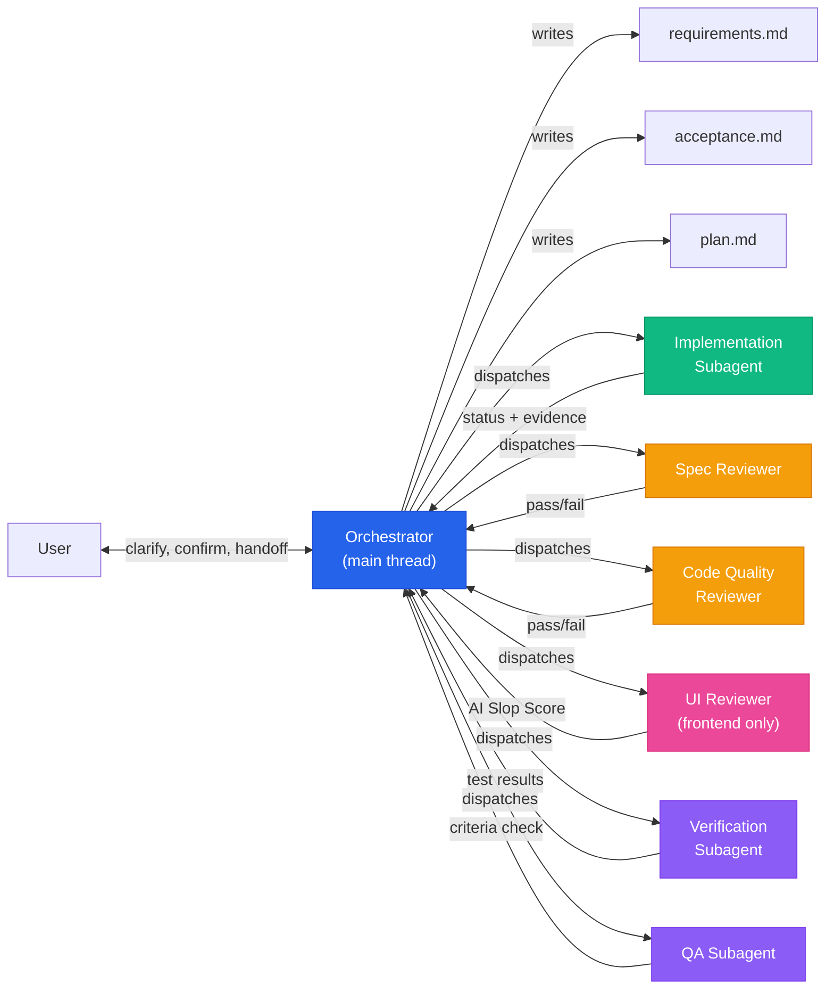
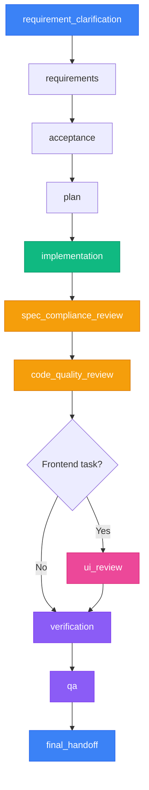

<p align="center">
    <a href="https://github.com/xzh20121116/agent-workflow/stargazers" alt="Stars">
        </a>
    <a href="https://github.com/xzh20121116/agent-workflow/blob/master/LICENSE" alt="License">
        </a>
    <a href="https://github.com/xzh20121116/agent-workflow/issues" alt="Issues">
        </a>
    <a href="https://github.com/xzh20121116/agent-workflow/releases/latest" alt="Latest Release">
        </a>
</p>

<h1 align="center">Agent Workflow</h1>

<p align="center"><strong>Stop letting your AI coding agent freestyle your codebase.</strong></p>

<p align="center">
    Lightweight workflow skills for Claude Code, Codex, and other AI coding agents.<br/>
    Turns a "vibe coder" into a disciplined project manager that clarifies requirements,<br/>
    delegates to subagents, runs reviews, and delivers evidence — before claiming it's done.
</p>

<p align="center">
    <a href="README.md"><strong>English</strong></a>
    ·
    <a href="README_zh-CN.md"><strong>中文</strong></a>
</p>

---

## Why This Exists

AI coding agents are powerful. But give them a complex task and watch what happens:

- They start coding before understanding the requirement
- The main thread does everything — chatting, coding, testing, reviewing — all in one bloated context
- Context gets compressed, goals get lost, behavior drifts
- They say "done" without running a single test
- You ask "did you test the error case?" and they start over from scratch

**Agent Workflow fixes this** by adding one constraint: **the main thread never touches code.**

## Before / After

### Without Agent Workflow

```
User:  Add phone number editing to the profile page.
AI:    Sure, I'll update a few files.
AI:    [modified 6 files]
AI:    Done.
User:  Did you test it?
AI:    It should work.
User:  What about verifying the old number first?
AI:    Good point, let me add that.
AI:    [modified 4 more files]
AI:    Done.
User:  The context is getting long...
AI:    [context compressed, forgot earlier discussion]
```

### With Agent Workflow

```
User:  Use the heavy workflow: add phone number editing to the profile page.

Orchestrator:
  1. "What verification method?" → SMS code
  2. "Verify old number first?" → Yes
  3. Writes requirements.md → user confirms
  4. Writes acceptance.md → user confirms
  5. Writes plan.md

  ── Dispatches Implementation Subagent ──
     Returns: DONE (4 files, tests passing)

  ── Dispatches Spec Compliance Reviewer ──
     Result: PASS — all requirements covered

  ── Dispatches Code Quality Reviewer ──
     Result: PASS

  ── Dispatches Verification Subagent ──
     Result: PASS — 12 tests, 0 failures

  ── Dispatches QA Subagent ──
     Result: PASS — 8/8 acceptance criteria

  → Final handoff: feature complete, with evidence
```

The user answered 3 questions. The Orchestrator managed the rest. Every step has evidence.

## How It Works



## Orchestrator Boundaries

The Orchestrator has exactly **four jobs**. Everything else goes to subagents.

| The Orchestrator DOES | The Orchestrator NEVER |
|-----------------------|------------------------|
| Talks to the user — clarifies requirements, confirms, delivers | Reads source code for implementation |
| Manages state — state.json, requirements, acceptance, plan | Writes or edits code directly |
| Dispatches subagents — builds context packets, delegates via Agent tool | Runs tests, lint, or build commands |
| Synthesizes results — handles status, decides next action | Performs code review or UI review |

This is a hard rule, not a guideline. If you catch the Orchestrator doing any of the "NEVER" column, it's a bug.

## Why Subagents Matter

In a long AI coding session, the main thread's context grows with every turn: requirements, code diffs, test logs, review comments, fix attempts, user feedback, assumptions. After a few context compressions, the AI starts to:

- **Forget the original goal** — drifts into tangential work
- **Treat assumptions as facts** — unverified hypotheses become "known"
- **Modify unrelated files** — loses track of scope
- **Claim completion without checking** — says "done" without verifying acceptance criteria

This isn't a model capability problem. It's a context management problem.

Agent Workflow solves it by splitting the work:

| Component | What stays in context |
|-----------|----------------------|
| **Orchestrator** | Task state, user decisions, stage summaries, evidence, risks. Stays lightweight. |
| **Implementation Subagent** | Task + goal + relevant files + non-goals. Does one thing, returns status + evidence. |
| **Spec Reviewer** | Requirements + actual code. Compares line by line, returns pass/fail with references. |
| **Code Quality Reviewer** | Code + patterns. Checks structure, returns issues by severity. |
| **Verification Subagent** | Changed files + test commands. Runs tests, returns results. |
| **QA Subagent** | Acceptance criteria + code. Verifies each criterion, returns per-criterion status. |

Each subagent receives a **SubagentContextPacket** — a self-contained prompt with:

- **Task:** what to do
- **Goal:** success condition
- **Stop condition:** when to stop
- **Relevant files:** explicit file list
- **Known facts:** from requirements, acceptance
- **Non-goals:** what NOT to do
- **Expected output:** what to write, where
- **Verification expected:** how to confirm success

The subagent does its job and returns: **status, summary, changed files, evidence, risks, next action.** No conversation history leaking. No context bloat.

Multi-agent division of labor isn't for show. It makes complex tasks **more stable, more controllable, more auditable, and less likely to drift** under long-context pressure.

## Execution Gate: When to Ask, When to Proceed

Requirement clarification is a **judgment gate**, not an interrogation. The Orchestrator follows this rule:

> **Ask when the missing answer could materially change the implementation. Otherwise, record assumptions and proceed.**

| Situation | Action |
|-----------|--------|
| Clear enough to proceed | Start working |
| Low-risk assumption possible | Record assumption, continue |
| Ambiguity blocks implementation | Ask only the necessary questions |
| High-risk / destructive / security / payment / migration | Generate requirements + acceptance, request explicit approval |

This applies to **all task types**: backend, frontend, refactoring, bug fixes, infrastructure.

## Workflow Intensity: Use the Lightest Safe Workflow

Not every task needs the full heavy workflow. The principle is: **use the lightest safe workflow.**

| Task type | Workflow intensity | What runs |
|-----------|-------------------|-----------|
| Documentation, README, comments, prompts | **Minimal** | Edit files, return diff summary. No requirements/acceptance/plan/state. No subagents. |
| Simple bug fix, typo, config change | **Light** | Quick clarification, implementation + verification. Skip full review chain. |
| Feature, refactoring, multi-file change | **Heavy** | Full workflow: requirements → acceptance → plan → implementation → review → verification → QA. |
| Security, payment, auth, migration, large refactor | **Heavy + explicit approval** | Full workflow with user confirmation before implementation. |

Example — this README optimization is a documentation-only task. It doesn't need `requirements.md`, `acceptance.md`, `plan.md`, `state.json`, or QA subagents. It just needs: edit the file, show the diff, done.

## Workflow Stages



| Stage | Who runs | What happens |
|-------|----------|-------------|
| `requirement_clarification` | Orchestrator | Talks to user, clarifies ambiguities |
| `requirements` | Orchestrator | Writes requirements.md, user confirms |
| `acceptance` | Orchestrator | Writes acceptance.md with testable criteria, user confirms |
| `plan` | Orchestrator | Writes plan.md with executable task breakdown |
| `implementation` | Subagent | Implements code (worktree isolation for high-risk) |
| `spec_compliance_review` | Subagent | Reads actual code, compares to requirements line by line |
| `code_quality_review` | Subagent | Checks structure, correctness, maintainability |
| `ui_review` | Subagent | Catches AI slop — fonts, gradients, layout, responsiveness |
| `verification` | Subagent | Runs tests, lint, build |
| `qa` | Subagent | Verifies every acceptance criterion against code |
| `final_handoff` | Orchestrator | Reports results with evidence bundle |

## Key Features

| Feature | What it does |
|---------|-------------|
| **Orchestrator-subagent separation** | Main thread coordinates, subagents execute. The Orchestrator never writes code. |
| **SubagentContextPacket** | Self-contained prompts with task, goal, files, non-goals, verification. No conversation history leaking. |
| **Implementer 4-status return** | `DONE` / `DONE_WITH_CONCERNS` / `NEEDS_CONTEXT` / `BLOCKED` — Orchestrator handles each |
| **3-stage review** | Spec compliance + code quality + UI review (frontend tasks) |
| **Execution gate** | Ask only when the answer materially changes implementation; otherwise record assumptions and proceed |
| **Workflow intensity** | Lightest safe workflow — docs skip heavy workflow, simple fixes skip full review chain |
| **Checkpoint & resume** | Survives context resets via handoff.md. Never resumes from memory alone. |
| **Drift detection** | After each stage, verifies work still serves original intent |
| **Risk-based isolation** | High-risk tasks use git worktree isolation; medium-risk shares working directory |

## Quick Start

### AI-Assisted Install (Recommended)

Paste this to your AI coding agent:

```text
请阅读 https://github.com/xzh20121116/agent-workflow，帮我全局安装 agent-workflow 技能。
```

### Manual Install

```bash
git clone https://github.com/xzh20121116/agent-workflow.git ~/.agent-workflow

# Claude Code:
ln -s ~/.agent-workflow/skills/agent-workflow-init ~/.claude/skills/agent-workflow-init
ln -s ~/.agent-workflow/skills/agent-workflow-start ~/.claude/skills/agent-workflow-start

# Codex App:
ln -s ~/.agent-workflow/skills/agent-workflow-init ~/.codex/skills/agent-workflow-init
ln -s ~/.agent-workflow/skills/agent-workflow-start ~/.codex/skills/agent-workflow-start
```

## Usage

### Initialize a project

```text
帮我用 agent-workflow 初始化当前项目
```

### Start a feature (heavy workflow)

```text
用重任务流程处理：用户个人中心增加修改手机号功能
```

### Fix a bug

```text
用重任务流程处理：支付回调偶发失败，大概一天出现几次
```

### Beautify a frontend page

```text
用重任务流程美化 src/pages/landing/index.tsx 页面
```

### Run spec compliance review only

```text
帮我审查 src/services/auth.service.ts 是否符合 docs/requirements.md 中的需求
```

### Run code quality review only

```text
帮我做代码质量审查：src/services/order.service.ts
```

## Included Skills

| Skill | Purpose |
|-------|---------|
| `agent-workflow-init` | Project-level bootstrapper. Creates `docs/agent/` structure, AGENTS.md, project config. |
| `agent-workflow-start` | Request-level entry point. Creates request workspace, drives the full workflow from clarification to delivery. |

### Subagent Prompt Templates

Each role has a dedicated prompt template in `skills/agent-workflow-start/references/`:

| Template | Role | Key Feature |
|----------|------|-------------|
| `implementer-prompt.md` | Backend implementation | SubagentContextPacket, 4-status return |
| `frontend-implementer-prompt.md` | Frontend implementation | Design constraints (typography, color, layout, motion) |
| `spec-reviewer-prompt.md` | Spec compliance review | "Do Not Trust the Report" — reads actual code |
| `code-quality-reviewer-prompt.md` | Code quality review | Structure, correctness, maintainability |
| `ui-reviewer-prompt.md` | UI/visual review | AI Slop Score, responsive check, accessibility |
| `verification-prompt.md` | Test/lint/build | Runs project test suite |
| `qa-prompt.md` | Acceptance criteria | Verifies every criterion against code |

## Example Output

After a successful workflow run, you get:

```
docs/agent/requests/REQ-20260609-001/
├── requirements.md          # What we're building
├── acceptance.md            # How we verify it
├── plan.md                  # Task breakdown
├── state.json               # Machine-readable state
├── handoff.md               # Checkpoint for resume
├── implementation.md        # What was built, files changed
├── review.md                # Spec + code quality findings
├── verification.md          # Test results, lint output
└── qa.md                    # Acceptance criteria check
```

Every claim is backed by evidence. No "theoretically it should work."

## Origin Story

Agent Workflow came from **real daily usage** — hitting the same pain points over and over: AI agents freestyle-coding without understanding requirements, main threads bloating with code + tests + reviews all mixed together, context compression causing goal drift.

After building the initial version, the author found [Aegis](https://github.com/GanyuanRan/Aegis) and [Superpowers](https://github.com/obra/superpowers). Both had valuable ideas. Agent Workflow **absorbed the best of both** and added what was still missing.

## What Agent Workflow Does That Others Don't

| | Agent Workflow | Aegis | Superpowers |
|---|---|---|---|
| **Main thread** | **Never touches code** | Coordinator + baseline | Auto-trigger |
| **Review** | **3-stage** (spec + quality + UI) | 2-stage | 2-stage |
| **Implementer** | **4-status return** | Subagent-driven | Plan-driven |
| **Context** | **SubagentContextPacket** (isolated) | Baseline context | Plan-as-junior |
| **Execution gate** | Ask only when needed, record assumptions | Baseline-read before changes | Uniform process |
| **Workflow intensity** | Lightest safe workflow per task type | Risk-adaptive | Uniform |
| **Setup** | **Zero config** | Doctor script | Per-host plugin |

### Core advantage: Orchestrator discipline

The #1 failure mode of AI coding agents on complex tasks: **the main thread does everything** — chatting, coding, testing, reviewing — all in one bloated context. Then context gets compressed, goals get lost, behavior drifts.

Agent Workflow enforces a hard rule: **the Orchestrator never reads, writes, or reviews code.** Every coding task goes to a subagent with a self-contained context packet. The Orchestrator's context stays clean. The subagent stays focused. No leaking.

This applies to **all task types**: backend APIs, database migrations, refactoring, bug fixes, infrastructure changes, and yes, frontend too.

### Core advantage: SubagentContextPacket

Each subagent gets a self-contained context packet — task, goal, files, non-goals, verification. No conversation history leaking in. The subagent does its job and returns evidence.

### Core advantage: 3-stage review

Other tools have 2-stage review. Agent Workflow has 3: spec compliance, code quality, and UI review (for frontend tasks). The first two apply to **every task**.

### Bonus: Frontend quality control

AI-generated frontends have a distinctive "plastic look." Agent Workflow addresses this through design constraints and a dedicated UI Reviewer. But this is one feature among many, not the core value proposition.

### When Agent Workflow is the right choice

- You want the main thread to stay focused on coordination, not coding
- You want explicit status handling (DONE / DONE_WITH_CONCERNS / NEEDS_CONTEXT / BLOCKED)
- You want self-contained subagent execution with no context leaking
- You want a simple setup with minimal configuration
- You want the best ideas from Aegis and Superpowers without the complexity

### When to use something else

- Complex enterprise codebase needing baseline reads before every change → [Aegis](https://github.com/GanyuanRan/Aegis)
- TDD-first team wanting strict red-green-refactor as non-negotiable discipline → [Superpowers](https://github.com/obra/superpowers)

## Project Structure

```
.
├── skills/
│   ├── agent-workflow-init/
│   │   ├── SKILL.md
│   │   ├── references/agent-workflow-guide.md
│   │   ├── assets/templates/
│   │   │   ├── AGENTS.md.template
│   │   │   └── change-request-template.md
│   │   └── scripts/
│   │       ├── init_agent_workflow.py
│   │       └── install_symlinks.sh
│   └── agent-workflow-start/
│       ├── SKILL.md
│       ├── references/
│       │   ├── start-guide.md
│       │   ├── implementer-prompt.md
│       │   ├── frontend-implementer-prompt.md
│       │   ├── spec-reviewer-prompt.md
│       │   ├── code-quality-reviewer-prompt.md
│       │   ├── ui-reviewer-prompt.md
│       │   ├── verification-prompt.md
│       │   └── qa-prompt.md
│       └── scripts/
│           └── start_agent_workflow.py
├── LICENSE
└── README.md
```

## Inspired By

- [Aegis](https://github.com/GanyuanRan/Aegis) — baseline-first, evidence-driven method pack for AI coding agents
- [Superpowers](https://github.com/obra/superpowers) — composable agent skills by Jesse Vincent

## License

MIT License. See [LICENSE](LICENSE).
