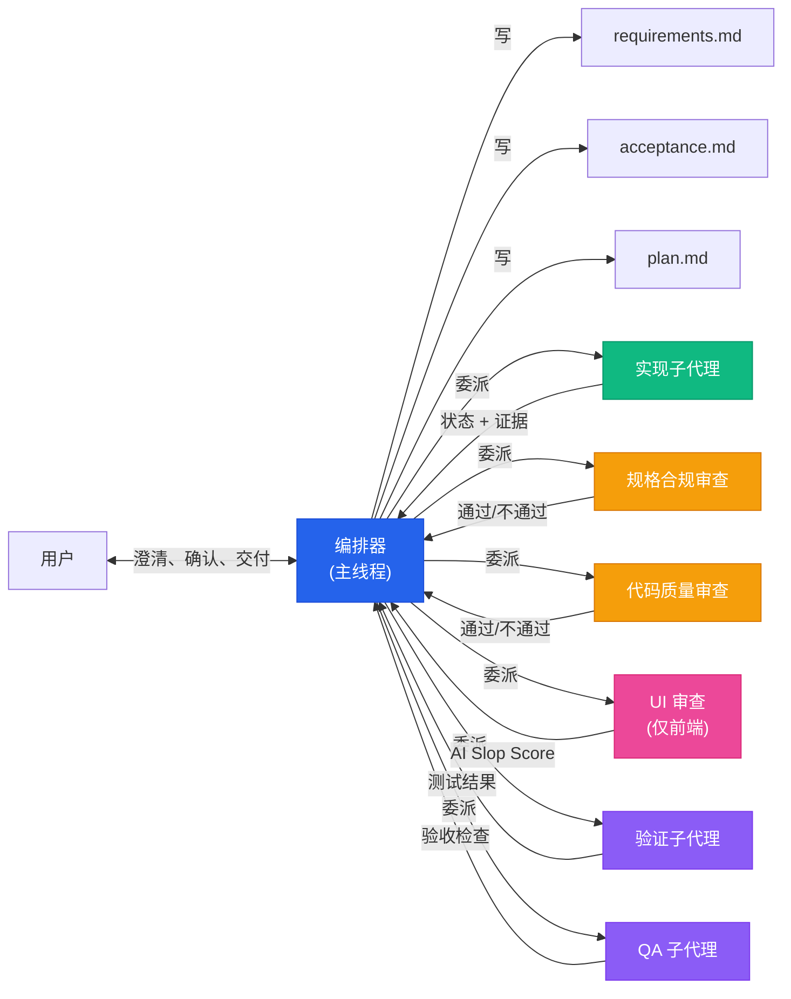
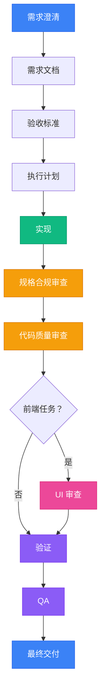
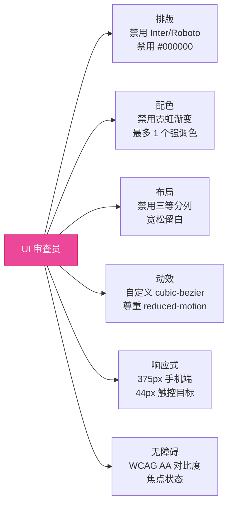

<p align="center">
    <a href="https://github.com/xzh20121116/agent-workflow/stargazers" alt="Stars">
        </a>
    <a href="https://github.com/xzh20121116/agent-workflow/blob/master/LICENSE" alt="License">
        </a>
    <a href="https://github.com/xzh20121116/agent-workflow/issues" alt="Issues">
        </a>
    <a href="https://github.com/xzh20121116/agent-workflow/releases/latest" alt="Latest Release">
        </a>
</p>

<h1 align="center">Agent Workflow</h1>

<p align="center"><strong>别再让 AI 一边聊天一边乱改你的代码库。</strong></p>

<p align="center">
    给 Claude Code、Codex 等 AI 编程代理使用的轻量工作流技能包。<br/>
    把"自由发挥的程序员"变成"会澄清需求、会分工、会审查、会验证、会交付证据的项目经理型 Agent"。
</p>

<p align="center">
    <a href="README.md"><strong>English</strong></a>
    ·
    <a href="README_zh-CN.md"><strong>中文</strong></a>
    ·
    <a href="docs/comparison.md">与 Aegis、Superpowers 的详细对比</a>
</p>

---

## 为什么需要它

AI 编程代理很强。但给它一个复杂任务，你会看到：

- 需求没澄清就开工，代码写了一半才发现理解错了
- 主线程又聊天又写代码又跑测试，上下文越来越长，压缩几次之后目标漂移了
- 做到后面忘记最初要什么，开始自己发挥
- 跑都没跑就说"已完成"，你一问"测了吗？"它说"理论上应该可以"
- 前端页面满屏 Inter 字体 + 紫色渐变 + 三等分卡片，一看就是 AI 味
- 你追问一个细节，它把之前做的全推翻重来

**Agent Workflow 通过一条规则解决这些问题：主线程永远不碰代码。**

主线程变成编排器（Orchestrator）—— 一个项目经理，只跟你对话、澄清需求、委派任务、汇总结果。写代码、跑测试、做审查，全部交给专门的子代理。每个子代理拿到自包含的上下文包，完成后只把结论、证据、风险点返回给编排器。不泄漏对话历史，不堆积上下文，不漂移。

## Before / After

### 没有 Agent Workflow

```
用户:  给个人中心加手机号修改功能
AI:    好的，我来改几个文件
AI:    [改了 6 个文件]
AI:    已完成
用户:  测了吗？
AI:    理论上应该可以
用户:  旧手机号要验证吗？
AI:    好的，我加上
AI:    [又改了 4 个文件]
AI:    已完成
用户:  UI 怎么还是三等分布局...
AI:    我来重新设计
AI:    [上下文已压缩，忘记了之前的讨论]
```

### 有 Agent Workflow

```
用户:  用重任务流程处理：个人中心增加修改手机号功能

编排器:
  1. "需要哪些验证方式？" → 短信验证码
  2. "旧手机号需要验证吗？" → 需要
  3. 写 requirements.md → 用户确认
  4. 写 acceptance.md → 用户确认
  5. 写 plan.md

  ── 派发【实现子代理】──
     返回: DONE (4 files, tests passing)

  ── 派发【规格合规审查】──
     结果: PASS — 需求全部覆盖

  ── 派发【代码质量审查】──
     结果: PASS

  ── 派发【验证子代理】──
     结果: PASS — 12 tests, 0 failures

  ── 派发【QA 子代理】──
     结果: PASS — 8/8 验收标准

  → 交付：功能完成，附带测试证据
```

用户回答了 3 个问题。编排器管理了剩下的一切。每一步都有证据。

## 工作原理



**编排器永远不直接编辑代码。** 它只做四件事：

1. **与用户对话** — 需求澄清、确认、最终交付
2. **管理状态** — 读写 state.json、需求文档、验收标准、计划
3. **委派子代理** — 构建自包含的上下文包，通过 Agent 工具分发
4. **综合结果** — 处理子代理状态，决定下一步

## 为什么用子代理？

这不是为了炫技。它解决真实问题：

| 问题 | 子代理如何解决 |
|------|---------------|
| **上下文膨胀** | 每个子代理只拿到它需要的信息 — 聚焦的上下文包，不是整个对话 |
| **目标漂移** | 子代理有明确的停止条件，不会跑偏 |
| **"完成"没证据** | 验证和 QA 是独立子代理，跑真实测试，不是"理论上应该可以" |
| **审查偏见** | 审查员是不同于实现者的子代理 — 它读实际代码，不读报告 |
| **主线程过载** | 编排器保持轻量，代码、测试、审查在隔离环境中并行 |

## 阶段流程



| 阶段 | 执行者 | 说明 |
|------|--------|------|
| `requirement_clarification` | 编排器 | 与用户对话，消除歧义 |
| `requirements` | 编排器 | 写 requirements.md，用户确认 |
| `acceptance` | 编排器 | 写可测试的验收标准，用户确认 |
| `plan` | 编排器 | 写可执行的任务分解 |
| `implementation` | 子代理 | 实现代码（高风险用 worktree 隔离） |
| `spec_compliance_review` | 子代理 | 读实际代码，逐条对比需求 |
| `code_quality_review` | 子代理 | 检查结构、正确性、可维护性 |
| `ui_review` | 子代理 | 抓 AI 味 — 字体、渐变、布局、响应式 |
| `verification` | 子代理 | 跑测试、lint、构建 |
| `qa` | 子代理 | 逐条验证验收标准 |
| `final_handoff` | 编排器 | 带证据包向用户汇报 |

## UI 审查：消灭 AI 味

AI 生成的前端有一种标志性的"塑料感"：满屏 Inter 字体、紫蓝渐变、三等分布局、重阴影、占位符内容。我们称之为 **AI slop**。

UI 审查员是一个专门的子代理，抓住代码审查发现不了的问题：



输出 **AI Slop Score (0-10)**：0 = 像手工打造的，10 = 最大 AI 味。

前端实现者的提示词中也会注入**设计约束**：排版规则、配色限制、布局模式、动效指南、图标选择、内容规则（禁用占位符名字、禁用 em-dash、只用真实文案）。

## 核心特性

| 特性 | 说明 |
|------|------|
| **编排器-子代理分离** | 主线程协调，子代理执行。编排器永远不写代码。 |
| **SubagentContextPacket** | 自包含提示词：任务、目标、文件、非目标、验证条件。不泄漏对话历史。 |
| **两阶段审查** | 规格合规（做对了吗？）+ 代码质量（做好了吗？） |
| **UI 审查** | AI Slop Score (0-10)、响应式检查、无障碍审计、设计约束执行 |
| **前端设计约束** | 排版、配色、布局、动效规则注入实现者提示词 |
| **实现者四状态返回** | `DONE` / `DONE_WITH_CONCERNS` / `NEEDS_CONTEXT` / `BLOCKED` |
| **检查点 & 恢复** | 通过 handoff.md 在上下文重置后恢复。永远不从记忆恢复。 |
| **漂移检测** | 每个阶段后验证工作是否仍服务于原始意图 |
| **风险隔离** | 高风险任务用 git worktree 隔离；中风险共享工作目录 |

## 快速开始

### AI 辅助安装（推荐）

把这段话交给你的 AI 编程代理：

```text
请阅读 https://github.com/xzh20121116/agent-workflow，帮我全局安装 agent-workflow 技能。
```

代理会自动识别你的宿主（Claude Code、Codex 等），克隆仓库，配置路径，验证安装。

### 手动安装

```bash
# 克隆到统一位置
git clone https://github.com/xzh20121116/agent-workflow.git ~/.agent-workflow

# 符号链接到宿主的 skill 目录
# Claude Code:
ln -s ~/.agent-workflow/skills/agent-workflow-init ~/.claude/skills/agent-workflow-init
ln -s ~/.agent-workflow/skills/agent-workflow-start ~/.claude/skills/agent-workflow-start

# Codex App:
ln -s ~/.agent-workflow/skills/agent-workflow-init ~/.codex/skills/agent-workflow-init
ln -s ~/.agent-workflow/skills/agent-workflow-start ~/.codex/skills/agent-workflow-start
```

## 使用

### 初始化项目

```text
帮我用 agent-workflow 初始化当前项目
```

创建 `docs/agent/` 目录结构、AGENTS.md、项目配置。

### 发起功能需求（重任务流程）

```text
用重任务流程处理：用户个人中心增加修改手机号功能
```

编排器会澄清需求、写验收标准、等你确认，然后自动走完整个阶段流程。

### 修复 Bug

```text
用重任务流程处理：支付回调偶发失败，大概一天出现几次
```

编排器先跟你排查，然后委派实现子代理定位根因并修复。

### 美化前端页面

```text
用重任务流程美化 src/pages/landing/index.tsx 页面
```

自动使用带设计约束的前端实现者，并增加 UI 审查阶段。

### 只做规格合规审查

```text
帮我审查 src/services/auth.service.ts 是否符合 docs/requirements.md 中的需求
```

### 只做代码质量审查

```text
帮我做代码质量审查：src/services/order.service.ts
```

## 包含的技能

两个 skill，零配置：

| 技能 | 用途 |
|------|------|
| `agent-workflow-init` | 项目级初始化器。创建 `docs/agent/` 结构、AGENTS.md、项目配置。 |
| `agent-workflow-start` | 需求级入口。创建需求工作区，驱动从澄清到交付的完整流程。 |

### 子代理提示词模板

每个角色都有专用的提示词模板，位于 `skills/agent-workflow-start/references/`：

| 模板 | 角色 | 核心特点 |
|------|------|----------|
| `implementer-prompt.md` | 后端实现 | SubagentContextPacket、四状态返回 |
| `frontend-implementer-prompt.md` | 前端实现 | 设计约束（排版、配色、布局、动效） |
| `spec-reviewer-prompt.md` | 规格合规审查 | "不要相信报告" — 读实际代码 |
| `code-quality-reviewer-prompt.md` | 代码质量审查 | 结构、正确性、可维护性 |
| `ui-reviewer-prompt.md` | UI/视觉审查 | AI Slop Score、响应式检查、无障碍 |
| `verification-prompt.md` | 测试/lint/构建 | 运行项目测试套件 |
| `qa-prompt.md` | 验收标准 | 逐条验证验收条件 |

## 运行产物

一次成功的流程结束后，你会得到：

```
docs/agent/requests/REQ-20260609-001/
├── requirements.md          # 我们要做什么
├── acceptance.md            # 怎么验证它
├── plan.md                  # 任务分解
├── state.json               # 机器可读的状态
├── handoff.md               # 恢复检查点
├── implementation.md        # 做了什么，改了哪些文件
├── review.md                # 规格 + 代码质量审查结果
├── verification.md          # 测试结果、lint 输出
└── qa.md                    # 验收标准检查
```

每个声明都有证据支撑。没有"理论上应该可以"。

## 项目由来

Agent Workflow 不是凭空设计的。它来自**真实的日常使用** — 反复遇到同样的痛点：AI 代理不理解需求就开始乱写代码，主线程又聊天又写代码又跑测试导致上下文膨胀，压缩几次之后目标漂移，前端页面一看就是 AI 做的。

初始版本完成后，作者在网上搜索类似项目，发现了 [Aegis](https://github.com/GanyuanRan/Aegis) 和 [Superpowers](https://github.com/obra/superpowers)。两者都有宝贵的思想：

- **Aegis** 带来了 baseline-first 纪律和 evidence-gated 完成机制
- **Superpowers** 开创了可组合的子代理驱动开发

Agent Workflow **吸收了两者的精华**，并补齐了它们没有覆盖的部分：严格的编排器-子代理分离、前端设计约束、专用 UI 审查、零配置安装。最终形成一个由实战驱动、而非理论驱动的工具。

## 与类似工具的对比

| | Agent Workflow | Aegis | Superpowers |
|---|---|---|---|
| **由来** | 真实使用场景 + 吸收 Aegis & Superpowers 精华 | 面向复杂代码库的方法包 | 可组合技能框架 |
| **理念** | 信任流程，不信任代理 | baseline-first、evidence-driven | TDD + 系统化流程 |
| **主线程** | **永远不碰代码** — 严格编排器分离 | 协调者 + baseline 读取 | 技能自动触发 |
| **UI/前端** | **内置设计约束 + UI 审查员 + AI Slop Score** | 不包含 | 不包含 |
| **审查** | **三阶段**：规格合规 + 代码质量 + UI 审查 | 两阶段：规格 + 代码质量 | 两阶段代码审查 |
| **实现者状态** | **四状态返回**：DONE / DONE_WITH_CONCERNS / NEEDS_CONTEXT / BLOCKED | 子代理驱动 | 计划驱动 |
| **安装** | **clone + symlink，零配置** | 引导式 + doctor 脚本 | 逐宿主插件安装 |
| **上下文管理** | **SubagentContextPacket** 隔离每个任务，不泄漏对话历史 | baseline 上下文 | 计划即初级工程师 |
| **最适合** | **前端项目、编排器纪律、简单安装** | 复杂企业代码库 | TDD 优先团队 |

详细对比见 [docs/comparison.md](docs/comparison.md)。

### Agent Workflow 独有的优势

**前端质量控制。** 三者中唯一能抓住 AI 生成的 UI 问题。UI 审查员检查排版、配色、布局、动效、响应式、无障碍 — 然后用 AI Slop Score (0-10) 打分。前端实现者的提示词中也会注入设计约束，从源头防止问题。

**严格的编排器纪律。** Aegis 和 Superpowers 在某些场景下允许主线程碰代码。Agent Workflow 执行硬规则：编排器永远不读、不写、不审查代码。所有编码任务都交给子代理。杜绝上下文膨胀和目标漂移。

**SubagentContextPacket。** 每个子代理拿到自包含的上下文包 — 任务、目标、文件、非目标、验证条件。对话历史不泄漏。子代理保持专注，编排器的上下文保持干净。

**零配置。** 两个 skill，不需要 doctor 脚本，不需要 activation mode，不需要 host registry。克隆、符号链接、开始干活。

### 什么时候用 Agent Workflow

- 你关注前端质量，想消灭 AI 味
- 你希望主线程专注协调，不碰代码
- 你想要简单的安装和最少的配置
- 你想要显式的状态处理（DONE / BLOCKED / NEEDS_CONTEXT）而不是假设
- 你想要 Aegis 和 Superpowers 的精华，但不要它们的复杂度

### 什么时候用别的

- 复杂企业代码库，改动前需要 baseline 读取 → [Aegis](https://github.com/GanyuanRan/Aegis)
- TDD 优先团队，红-绿-重构不可妥协 → [Superpowers](https://github.com/obra/superpowers)

## 项目结构

```
.
├── skills/
│   ├── agent-workflow-init/
│   │   ├── SKILL.md
│   │   ├── references/agent-workflow-guide.md
│   │   ├── assets/templates/
│   │   │   ├── AGENTS.md.template
│   │   │   └── change-request-template.md
│   │   └── scripts/
│   │       ├── init_agent_workflow.py
│   │       └── install_symlinks.sh
│   └── agent-workflow-start/
│       ├── SKILL.md
│       ├── references/
│       │   ├── start-guide.md
│       │   ├── implementer-prompt.md
│       │   ├── frontend-implementer-prompt.md
│       │   ├── spec-reviewer-prompt.md
│       │   ├── code-quality-reviewer-prompt.md
│       │   ├── ui-reviewer-prompt.md
│       │   ├── verification-prompt.md
│       │   └── qa-prompt.md
│       └── scripts/
│           └── start_agent_workflow.py
├── .claude-plugin/plugin.json
├── .codex-plugin/plugin.json
├── LICENSE
└── README.md
```

## 致谢

- [Aegis](https://github.com/GanyuanRan/Aegis) — baseline-first、evidence-driven 的 AI 编程代理方法包
- [Superpowers](https://github.com/obra/superpowers) — Jesse Vincent 创建的可组合代理技能

## 许可证

MIT License。见 [LICENSE](LICENSE)。
